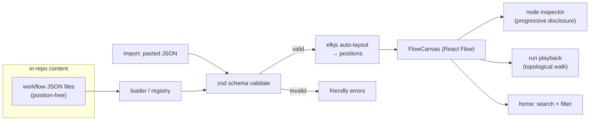
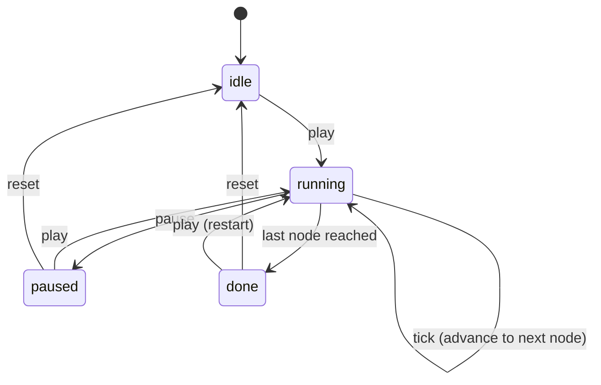

# feat: 10x Workflow Viz — data-driven, legible, alive

## Summary

Turn Workflow Viz from a static, hand-coded showcase of four workflows into a **data-driven visualization tool** that scales to a large library and stays legible for non-techies and techies at the same time. Three pillars:

1. **Data-driven core** — workflows become position-free JSON validated by a schema; an auto-layout engine (elkjs) computes node positions so authoring a new workflow is *just data*, never hand-placed `x/y`.
2. **Legibility through progressive disclosure** — the graph reads clean by default (icon + label); clicking any node opens an inspector that reveals plain-language explanation, tool, and config. Plus an animated "run" playback that walks the flow step by step so a non-technical viewer *sees* what happens.
3. **A library that scales** — search + filter on the home grid, an import/preview surface for pasting schema JSON, and several new example workflows that prove authoring is painless.

The existing dark aesthetic is already strong and is preserved; this plan adds capability and structure, not more glow.

---

## Problem Frame

The current app is visually polished but **inert and unscalable**:

- **Inert** — clicking a node does nothing. All depth (description, tool) is crammed onto every card, which clutters as graphs grow, yet there's still no way to see *config* or a plain-language explanation. Nothing conveys that a workflow *runs* in an order.
- **Unscalable** — every node carries hand-coded `position: { x, y }`. Adding or editing a workflow means manually placing nodes on a grid. This caps the library at "a few demos" and makes the four existing files tedious to maintain.
- **Hard to browse** — the home page lists all workflows with no search or filter; at 30 workflows it becomes a wall.

The audience is dual: a non-technical prospect/stakeholder must grasp the *story* of a workflow, while a technical viewer wants the *config*. Today neither is served well — cards are too technical for the former and too shallow for the latter.

**Scope confirmed with user:** in-repo JSON files (no backend/database), a generic JSON workflow schema (no ingestion of n8n/Make/Zapier exports this pass), and **no visual drag-and-drop editor** — authoring is data-driven.

---

## Requirements

- **R1** — A workflow is defined as position-free JSON conforming to a documented schema; positions are computed, never authored.
- **R2** — A schema validator parses workflow JSON and rejects malformed input (missing fields, unknown node types, edges referencing non-existent nodes) with human-readable errors.
- **R3** — Auto-layout computes a clean left-to-right layered layout for any valid workflow, including branching, multiple triggers, and fan-out.
- **R4** — The default graph is uncluttered (node shows icon + label + optional compact tool chip). Description, config, inputs/outputs, and plain-language explanation are revealed on demand via a node inspector (progressive disclosure).
- **R5** — A run playback control animates the flow in execution order: nodes light up sequentially, edges along the active path animate, with play / pause / step / reset.
- **R6** — The home library supports free-text search and filtering by category, complexity, and node type, with a live result count and empty state.
- **R7** — An import/preview surface accepts pasted or uploaded schema JSON, validates it, and renders it on the same canvas without persisting (ephemeral).
- **R8** — The workflow library is expanded with several new example workflows authored purely as JSON, proving R1–R3 in practice.
- **R9** — All existing behavior (routing, dark theme, Danish UI, minimap/controls, category/complexity badges) is preserved.

**Success criteria:** a non-technical viewer can open any workflow, press play, watch it run, and click any step to read a plain-language explanation — with zero technical jargon required to follow the story. A technical viewer gets full tool + config in the inspector. Adding a new workflow is writing one JSON file and nothing else.

---

## High-Level Technical Design

### Data flow (JSON → canvas → consumers)



The schema is the single contract. Both in-repo files and pasted import JSON pass through the same validate → layout → canvas pipeline, so import gets correctness and layout for free.

### Workflow schema shape (directional, not final)

```text
Workflow {
  id, title, description, category, complexity, tags[]
  summary?           // plain-language one-liner for non-techies
  nodes: WorkflowNode[]   // NO position field
  edges: WorkflowEdge[]
}
WorkflowNode {
  id, type (NodeType enum), label
  description?       // technical detail (inspector)
  plainLanguage?     // "what this does" in human terms (inspector)
  tool?              // e.g. "GPT-4o"
  config?: Record<string,string>
  io?: { inputs?: string[]; outputs?: string[] }   // optional
}
WorkflowEdge { id, source, target, label?, animated? }
```

`position` is removed from the authored type entirely; layout injects it before the data reaches React Flow.

### Run playback state machine



Playback derives execution order by topological sort from trigger nodes; on each tick it marks the current node "active" and animates outgoing edges. A cycle (should not occur in valid DAGs) is broken by a visited-set guard so playback always terminates.

---

## Output Structure

New and changed files (repo-relative; `~` marks new):

```text
src/
  types/workflow.ts          # position-free authored types + plainLanguage/summary/io
  lib/
    schema.ts            ~   # zod schema + validateWorkflow()
    layout.ts            ~   # elkjs auto-layout: nodes+edges → positioned nodes
    playback.ts          ~   # topological order + playback step logic (pure)
    node-config.ts           # unchanged (colors/icons)
    workflow-filter.ts   ~   # pure search/filter predicate for the library
  data/
    index.ts                 # loader validates all workflows at module load
    workflows/*.ts           # converted to position-free; + several new ones
  components/
    FlowCanvas.tsx           # runs layout, wires onNodeClick + playback overlay
    WorkflowNode.tsx         # slimmed default card
    NodeInspector.tsx    ~   # right-side slide-over, progressive disclosure
    PlaybackControls.tsx ~   # play/pause/step/reset
    LibraryBrowser.tsx   ~   # client: search + filter UI over the grid
    WorkflowCard.tsx         # minor: simpler pills
  app/
    page.tsx                 # renders LibraryBrowser
    import/page.tsx      ~   # paste/upload JSON → validate → preview
    workflow/[id]/...        # detail page wires inspector + playback
```

The per-unit **Files** lists are authoritative; this tree is the scope-at-a-glance.

---

## Key Technical Decisions

- **KTD1 — elkjs for auto-layout.** React Flow v12 has no built-in layout; elkjs (`elk.layered`, direction `RIGHT`) is the React Flow team's recommended layered-layout engine and handles branching/fan-out better than dagre, which is now in maintenance. Runs main-thread on mount — graph sizes here (<~40 nodes) lay out in tens of milliseconds. See Alternatives for dagre trade-off.
- **KTD2 — zod for schema validation.** Import (R7) and load-time validation (R2) need friendly, structured errors. zod gives a single source-of-truth schema that also infers the TS types, so the authored type and the runtime validator never drift. Small, well-established dependency.
- **KTD3 — Positions are derived, never authored.** The authored `WorkflowNode` type drops `position`. Layout injects `position` when mapping to React Flow nodes. This is the core enabler for painless authoring and is enforced by the type system.
- **KTD4 — Client-side layout on mount, no build step.** Layout runs in `FlowCanvas` after data arrives, then `fitView`. Avoids a precompute/build pipeline, keeps "drop a JSON file" authoring truly one-step. A brief layout state (skeleton/no-flash) covers the async gap.
- **KTD5 — Progressive disclosure via a node inspector panel, not richer cards.** Depth moves *off* the node and *into* a right-side slide-over opened on click. Keeps the default graph clean at scale (R4) while giving techies full config. The existing left sidebar stays as workflow-level meta.
- **KTD6 — Playback logic is a pure module.** Topological ordering and step advancement live in `lib/playback.ts` as pure functions (unit-testable); the component only renders state. Same discipline for search/filter (`lib/workflow-filter.ts`).
- **KTD7 — Import is ephemeral.** Per confirmed scope (in-repo files, no backend), import validates and renders in-session only — no persistence. The canonical library remains JSON files committed to the repo.
- **KTD8 — Add Vitest.** No test runner exists. Add Vitest (user default) for the pure logic modules (schema, layout adapter, playback, filter). Component/flow coverage stays light this pass.

---

## Implementation Units

### U1. Workflow schema + position-free data model

**Goal:** Establish the JSON schema as the single source of truth and remove authored positions.
**Requirements:** R1, R2, R9.
**Dependencies:** none.
**Files:**
- `src/lib/schema.ts` (new) — zod schema for `Workflow`/`WorkflowNode`/`WorkflowEdge`; `validateWorkflow(input): { ok: true, workflow } | { ok: false, errors }`; edge-reference integrity check (every `source`/`target` resolves to a node id).
- `src/types/workflow.ts` — drop `position` from authored `WorkflowNode`; add optional `summary` (workflow), `plainLanguage`, `io` (node). Derive types from zod via `z.infer` where practical.
- `src/data/workflows/*.ts` — strip `position` from all nodes in the four existing workflows.
- `src/data/index.ts` — validate every workflow at module load; throw a clear aggregated error if any fails.
- `package.json` — add `zod`; add Vitest + config (`vitest.config.ts`, `src/test/setup.ts`).
- `src/lib/schema.test.ts` (new).

**Approach:** zod schema is authored once; the authored TS type is `z.infer<typeof workflowSchema>` so type and validator can't drift (KTD2). Edge integrity is a `superRefine` pass. Keep `NodeType`/`WorkflowCategory` as the existing string unions, expressed as `z.enum`.
**Patterns to follow:** existing `NodeType`/`WorkflowCategory` unions in `src/types/workflow.ts`; current per-workflow file structure in `src/data/workflows/`.
**Execution note:** Write the schema test first — it pins the contract every later unit depends on.
**Test scenarios** (`src/lib/schema.test.ts`):
- Valid workflow (one of the converted four) parses and returns `ok: true`.
- Missing required field (e.g. node `label`) → `ok: false` with a message naming the field.
- Unknown `node.type` (`"foo"`) → rejected with an enum error.
- Edge whose `source` references a non-existent node id → rejected with a message identifying the dangling edge.
- Edge whose `target` is missing → rejected.
- Node with no `position` field → accepted (positions are not authored).
- Optional fields (`plainLanguage`, `summary`, `io`, `config`) absent → accepted.
**Verification:** `npm run build` and the dev server load all four workflows with positions removed; schema tests pass; loading a deliberately broken workflow throws a readable error.

---

### U2. Auto-layout engine (elkjs)

**Goal:** Compute a clean left-to-right layered layout for any valid workflow.
**Requirements:** R3.
**Dependencies:** U1.
**Files:**
- `src/lib/layout.ts` (new) — `layoutWorkflow(nodes, edges): Promise<PositionedNode[]>` using `elk.layered`, direction `RIGHT`, sensible node-size + spacing constants; maps elk output back to React Flow nodes with injected `position`.
- `package.json` — add `elkjs`.
- `src/lib/layout.test.ts` (new).

**Approach (KTD1, KTD4):** Wrap elkjs behind one function that takes the authored nodes/edges, feeds elk a graph with fixed node dimensions matching the rendered card size, runs `elk.layered`, and returns nodes with `position`. Direction `RIGHT` preserves the current left-to-right reading order. Spacing tuned so branches (condition fan-out) don't overlap.
**Patterns to follow:** node dimensions implied by `WorkflowNode.tsx` (`min-w-[200px]`); current LR arrangement in the existing hand-placed data.
**Technical design (directional):** elk graph = `{ id:'root', layoutOptions:{ 'elk.algorithm':'layered', 'elk.direction':'RIGHT', spacing... }, children: nodes.map(→ {id,width,height}), edges: edges.map(→ {id,sources:[source],targets:[target]}) }`; after `elk.layout`, read each child's `x/y` into `position`.
**Test scenarios** (`src/lib/layout.test.ts`):
- Linear 3-node chain → three distinct positions, x strictly increasing, no NaN.
- Branching workflow (condition → two targets) → the two branch nodes get different `y`, neither overlaps.
- Multiple trigger nodes → all reachable nodes positioned, no node left at origin.
- Single-node workflow → returns one valid position.
- Every input node id appears exactly once in the output with a numeric `x` and `y`.
**Verification:** all four converted workflows render with no manual positions and read left-to-right with no overlapping nodes; `fitView` frames them sensibly.

---

### U3. Slim node + progressive-disclosure inspector

**Goal:** Clean default graph; depth on click.
**Requirements:** R4, R9.
**Dependencies:** U1 (schema fields), U2 (so positioned graph exists to click).
**Files:**
- `src/components/WorkflowNode.tsx` — reduce default card to icon + label + optional compact tool chip; remove inline description block; keep accent/glow styling and handles.
- `src/components/NodeInspector.tsx` (new) — right-side slide-over showing, in order: plain-language explanation (`plainLanguage`), then technical detail (`description`, `tool`, `config` key/values, `io` inputs/outputs). Close on backdrop/escape/X.
- `src/app/workflow/[id]/WorkflowDetailClient.tsx` — hold `selectedNodeId`; render inspector; clear selection on canvas click.
- `src/components/FlowCanvas.tsx` — accept `onNodeClick`/selection props; forward React Flow node-click to parent.
- `src/components/NodeInspector.test.tsx` (new).

**Approach (KTD5):** Selection state lives in `WorkflowDetailClient`. React Flow `onNodeClick` sets `selectedNodeId`; the inspector reads the node from the workflow by id. Plain-language sits visually *above* technical detail so a non-techie reads top-down and stops where they want — that ordering *is* the progressive disclosure. Inspector is a sibling overlay, not part of the canvas, so it never affects layout.
**Patterns to follow:** existing left sidebar styling in `WorkflowDetailClient.tsx` (backdrop-blur panels, white/opacity scale); badge styling in `node-config.ts`.
**Test scenarios** (`src/components/NodeInspector.test.tsx`):
- Given a node with `plainLanguage` + `description` + `config`, inspector renders the plain-language text before the technical detail.
- Node without `tool`/`config`/`io` → those sections are omitted, no empty headers.
- Node with `config` of N entries → N key/value rows render.
- Closing (X / escape) clears selection (callback fired).
- Default `WorkflowNode` card renders label + type but not the description text (moved to inspector).
**Verification:** opening a workflow shows clean cards; clicking any node slides in the inspector with plain-language first; clicking empty canvas dismisses it; no layout shift on open/close.

---

### U4. Animated run playback

**Goal:** Make the graph *run* visibly in execution order.
**Requirements:** R5.
**Dependencies:** U1, U2.
**Files:**
- `src/lib/playback.ts` (new) — `executionOrder(nodes, edges): string[]` (topological from triggers, visited-set guarded); a small reducer/stepper for `idle → running → paused → done`.
- `src/components/PlaybackControls.tsx` (new) — play / pause / step / reset + progress ("step 3 / 7").
- `src/components/FlowCanvas.tsx` — apply an "active" visual state to the current node and animate edges on the active path during playback.
- `src/app/workflow/[id]/WorkflowDetailClient.tsx` — own playback state + interval ticking; mount controls.
- `src/lib/playback.test.ts` (new).

**Approach (KTD6):** Ordering and state transitions are pure (`lib/playback.ts`); the component owns only the timer. On each tick, advance the active index; mark that node active (reuse the node's `glow`) and set the edges entering/leaving it to `animated`. Multiple triggers run in their topological interleaving. Reset returns to `idle` and clears all active styling.
**Technical design:** see the playback state machine in High-Level Technical Design.
**Test scenarios** (`src/lib/playback.test.ts`):
- Linear chain → `executionOrder` returns nodes in source-to-sink order.
- Branch (condition → A, B) → both branch nodes appear after the condition; order is stable.
- Multiple triggers → every node appears exactly once; each trigger precedes its descendants.
- Cyclic input (defensive) → terminates, every node visited at most once.
- Stepper: `play` from `idle` → `running`; `pause` → `paused`; advancing past the last node → `done`; `reset` from any state → `idle` at index 0.
**Verification:** pressing play walks the workflow node-by-node with edge animation and a live step counter; pause/step/reset behave; playback always ends in `done`, never hangs.

---

### U5. Library browse — search + filter

**Goal:** Make a large library navigable from the home page.
**Requirements:** R6, R9.
**Dependencies:** U1 (workflow metadata).
**Files:**
- `src/lib/workflow-filter.ts` (new) — pure `filterWorkflows(workflows, { query, category, complexity, nodeType }): Workflow[]`.
- `src/components/LibraryBrowser.tsx` (new, client) — search input + category/complexity/node-type filter chips + result count + empty state, rendering the existing card grid.
- `src/app/page.tsx` — keep hero/stats/legend (server), delegate the grid to `LibraryBrowser`.
- `src/lib/workflow-filter.test.ts` (new).

**Approach:** Filtering is a pure predicate over title/description/tags (text), `category`, `complexity`, and presence of a `nodeType`. The client component holds filter state and renders results; the server page stays for the static hero. Search matches title, description, and tags, case-insensitive.
**Patterns to follow:** existing `WorkflowCard` grid and badge/pill styling in `page.tsx`; `CATEGORY_LABELS`/`COMPLEXITY_COLORS` in `node-config.ts`.
**Test scenarios** (`src/lib/workflow-filter.test.ts`):
- Empty query + no filters → all workflows returned.
- Text query matching a title (case-insensitive) → only matching workflows.
- Text query matching a tag → matched.
- `category` filter → only that category.
- `complexity` filter → only that complexity.
- `nodeType` filter → only workflows containing a node of that type.
- Combined filters AND together; no-match → empty array (drives empty state).
**Verification:** typing in search narrows the grid live; each filter chip works alone and combined; result count updates; clearing filters restores the full grid; an impossible combination shows the empty state.

---

### U6. Import / preview surface

**Goal:** Paste or upload schema JSON and visualize it without persistence.
**Requirements:** R7.
**Dependencies:** U1 (validation), U2 (layout), U3 (inspector), U4 (playback) — reuses the full canvas.
**Files:**
- `src/app/import/page.tsx` (new) — textarea paste + file upload, "Visualize" action; on success render the same canvas/inspector/playback; on failure show validation errors.
- `src/components/ImportPanel.tsx` (new, optional split) — the input + error UI.
- A small navigation affordance to `/import` from the home page.
- `src/app/import/import.test.tsx` (new) or covered via `schema.test.ts` for the validation path.

**Approach (KTD7):** Reuse `validateWorkflow` (U1) then the canvas pipeline (U2–U4). Valid JSON renders ephemerally in-session; nothing is written to disk. Invalid JSON surfaces the structured zod errors from U1 in a readable list (field path + message). JSON parse errors (not valid JSON at all) are caught and shown distinctly from schema errors.
**Patterns to follow:** detail-page canvas wiring from U3/U4; panel styling from `WorkflowDetailClient.tsx`.
**Test scenarios:**
- Valid schema JSON pasted → renders on the canvas (positions auto-computed).
- Malformed JSON (syntax error) → "not valid JSON" message, no crash.
- Schema-invalid JSON (e.g. unknown node type) → field-level error list from validation.
- Empty input + Visualize → guarded, no crash.
**Verification:** pasting a sample workflow renders it identically to an in-repo one, with inspector and playback working; bad input shows clear errors and never throws.

---

### U7. Content expansion — new example workflows

**Goal:** Prove painless authoring and give the library real depth.
**Requirements:** R8, R1.
**Dependencies:** U1, U2 (authoring must be data-only by now).
**Files:**
- `src/data/workflows/*.ts` (several new) — new workflows as position-free JSON across the under-represented categories (operations, hr, marketing), each with `summary` and per-node `plainLanguage`.
- `src/data/index.ts` — register the new workflows.
- Backfill `plainLanguage`/`summary` on the original four so progressive disclosure (U3) has non-technical copy everywhere.

**Approach:** Author each new workflow as data only — no positions, relying on U2. This unit is also the real-world test of R1/R3: if authoring needs anything beyond writing JSON, U1/U2 are incomplete. Danish copy, consistent with existing tone.
**Patterns to follow:** the converted existing workflow files (post-U1); category set in `node-config.ts`.
**Test expectation:** none — content/data only; correctness is enforced by U1's load-time validation (a malformed new workflow fails the build) and U2's layout. No new behavioral logic.
**Verification:** new workflows appear in the (filterable) library, render with auto-layout, play back, and every node shows plain-language copy in the inspector.

---

### U8. Static generation + final polish

**Goal:** Fast static delivery and loose ends.
**Requirements:** R9.
**Dependencies:** U1–U7.
**Files:**
- `src/app/workflow/[id]/page.tsx` — add `generateStaticParams` over the workflow registry so detail routes prerender.
- `src/app/page.tsx` / metadata — minor copy/SEO pass if needed.
- README/`AGENTS.md` note — document the workflow JSON schema and "add a workflow = one JSON file" authoring step.

**Approach:** With the library known at build time, `generateStaticParams` prerenders every detail page. Keep the layout's client-side compute (KTD4) — only params generation is added. Read the Next 16 docs at `node_modules/next/dist/docs/01-app/03-api-reference/04-functions/generate-static-params.md` before writing it, per AGENTS.md.
**Test expectation:** none — config + docs. Verified by build output.
**Verification:** `npm run build` prerenders all workflow routes; no runtime regressions; README documents the authoring flow.

---

## Alternatives Considered

- **dagre instead of elkjs (KTD1).** dagre is lighter and simpler, but is in maintenance, gives weaker results on branching graphs, and offers fewer layout controls. For a tool meant to scale to many varied workflows, elkjs's layered algorithm is the safer long-term choice. dagre remains a drop-in fallback if elkjs bundle size or async ergonomics become a problem.
- **Precomputed layout at build time.** Could run elk in a build script and bake positions into the data. Rejected (KTD4): it reintroduces a build step between "write JSON" and "see it," undermining the one-step authoring goal. Client-side layout on graphs this size is imperceptible.
- **Explicit Simple/Technical mode toggle.** A global mode switch was considered for the dual audience. Rejected in favor of progressive disclosure (per user decision): one clean view with click-to-reveal depth is harder to clutter and needs no mode management.
- **Richer node cards instead of an inspector.** Putting config on the card scales badly — exactly the clutter to avoid. The inspector keeps the canvas clean at 30+ nodes.

---

## Risks & Dependencies

- **elkjs async/SSR.** elkjs runs client-side; ensure layout is invoked only in client components (`FlowCanvas` is already `"use client"`) and guard against running during SSR. Mitigation: layout in `useEffect`/on mount with a brief non-flashing layout state.
- **Layout flash on load.** Async layout can cause a frame where nodes sit at origin. Mitigation: withhold render (or show a skeleton) until positions resolve, then `fitView`.
- **Type/validator drift.** If authored types and zod schema are defined separately they can diverge. Mitigation (KTD2): infer the TS type from the zod schema.
- **New dependencies.** `elkjs` and `zod` are added. Both are mainstream and small; no backend introduced, consistent with the in-repo scope.
- **Playback on malformed graphs.** A cycle would hang a naive walk. Mitigation (KTD6): visited-set guard, unit-tested for termination.

---

## Scope Boundaries

**In scope:** data-driven JSON schema + validation, elkjs auto-layout, progressive-disclosure inspector, animated run playback, library search/filter, ephemeral import/preview, several new example workflows, static generation.

**Out of scope (confirmed with user):**
- Making or running real agents/automations — this is visualization only.
- Visual drag-and-drop / WYSIWYG editor — authoring is data-driven JSON.
- Ingesting third-party exports (n8n / Make / Zapier) — generic schema only this pass.
- Backend, database, auth, multi-user — in-repo files only.

**Deferred to follow-up work:**
- n8n/Make import adapters that map external exports onto the generic schema (the natural next differentiator for aiauto.dk).
- Persisted/shareable imported workflows (would require the backend that's out of scope now).
- Per-workflow "embed" / shareable link mode.

---

## Sources & Research

- Codebase read end-to-end: `src/types/workflow.ts`, `src/lib/node-config.ts`, `src/data/**`, `src/components/**`, `src/app/**`, `globals.css`. Current state: React Flow v12.11, hand-coded `x/y`, static cards, no interaction, Danish UI, Next 16 async params already handled correctly.
- Auto-layout: elkjs is React Flow v12's recommended layered-layout engine; dagre is the lighter, maintenance-mode alternative (captured in KTD1 / Alternatives).
- Next 16 specifics (async params confirmed in `src/app/workflow/[id]/page.tsx`); `generateStaticParams` docs to be read from `node_modules/next/dist/docs/` per AGENTS.md before U8.
- No external automation-export research performed — out of scope by user decision.
