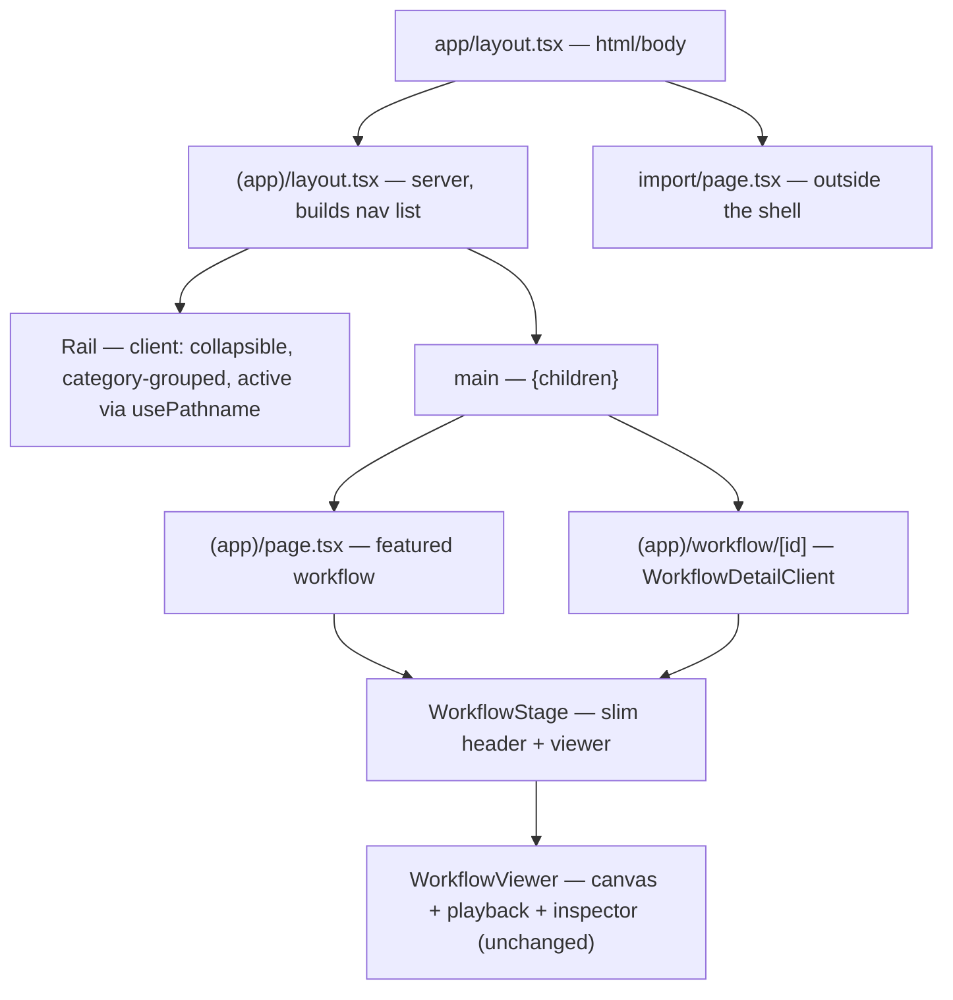

# refactor: graph-first UI, remove dashboard

## Summary

Replace the dashboard landing with a **graph-first** experience. Today the first page a visitor meets is chrome *about* the library — a hero, three stat cards, a node-type legend, and a search/filter grid. This plan makes the first page an actual workflow: a hand-picked featured workflow rendered full-bleed (canvas + playback + click-to-inspect), with a **slim collapsible left rail** as the only way to move between workflows. Per-workflow chrome shrinks to the essentials (title, plain-language summary, category), and everything non-essential — stats, legend, tag lists, node/edge counts, filtering, and the card grid — is removed.

The graph engine itself (auto-layout, inspector, run playback) is unchanged. This is a navigation-and-chrome refactor, not a feature change.

---

## Problem Frame

The app is a workflow *visualizer*, but the landing page shows no workflow. A first-time visitor sees:

- A large hero ("Workflow Visualizer" + subtitle).
- Three vanity stat cards (workflow / node / edge counts).
- A node-type legend.
- A search box + category/complexity/node-type filter chips + a grid of cards.

They must read, then click a card, then land on a graph — and even that graph page carries a fat sidebar (description, node-type tally, tags, node/edge counts) that competes with the canvas. The product's actual value — *seeing a workflow* — is two clicks and a lot of chrome away.

The user's directive: the first page should **be a workflow visualization**, and non-essential elements should be removed throughout.

**Confirmed scope decisions (user):** drop filtering/search entirely; navigation is a slim collapsible left rail; the landing shows one hand-picked featured workflow.

---

## Requirements

- **R1** — The landing route `/` renders a hand-picked featured workflow's interactive graph (canvas + playback + inspector), not a dashboard.
- **R2** — A slim, collapsible left rail lists every workflow grouped by category, highlights the active one, and is the sole navigation between workflows.
- **R3** — The rail persists its collapsed/expanded state across reloads with no hydration mismatch.
- **R4** — Per-workflow chrome is reduced to title, plain-language summary, and category. The node-type tally, tag list, node/edge counts, hero, stat cards, and legend are removed.
- **R5** — Filtering and search are removed entirely; the rail's grouped list is the only navigation.
- **R6** — `/workflow/[id]` deep links and static prerendering continue to work; the featured landing and the detail route share one per-workflow view.
- **R7** — Dead components and unused CSS from the old dashboard are removed and the test suite stays green.

**Success criteria:** a first-time visitor lands directly inside a living workflow graph; switching workflows is one click in the rail; nothing on screen is non-essential to understanding the workflow in front of them.

---

## High-Level Technical Design

### Route & component structure

A route group `(app)/` introduces a shared layout that keeps the rail mounted across navigations. Both the featured landing and the detail route render the same slim per-workflow stage.



### Landing layout (after)

```text
┌─────────┬─────────────────────────────────────────┐
│ ▸ Viz   │  Figma → Kode med Claude Code     [ops]  │
│         │  Plain-language summary line …           │
│ SALES   │ ┌─────────────────────────────────────┐ │
│  Lead…  │ │            ● node graph             │ │
│ OPS     │ │       ▶ ⏸ ⏭ ⟲   (playback)         │ │
│ ▸ PR…   │ │                                     │ │
│  Figma● │ └─────────────────────────────────────┘ │
│  …      │                                         │
│ ─────── │                                         │
│ Import  │                                         │
└─────────┴─────────────────────────────────────────┘
   ↑ collapsible rail        ↑ WorkflowStage (header + WorkflowViewer)
```

Collapsed, the rail becomes a narrow strip with an expand affordance; the canvas takes the reclaimed width.

---

## Key Technical Decisions

- **KTD1 — Route group `(app)/` with a shared `layout.tsx`.** The rail lives in a layout so it stays mounted across navigations (no remount flash, collapse state survives route changes). Cleaner than threading a shell component through every page.
- **KTD2 — Navigation via `<Link>` to existing SSG routes, not client state.** The rail links to `/workflow/[id]`. This preserves shareable/deep-linkable URLs and static prerendering — essential for a visualization tool people send to each other. A single-page client-state switcher would lose both.
- **KTD3 — Featured landing renders the workflow directly at `/`** (no redirect), keeping a clean root URL. The featured id is a single constant.
- **KTD4 — Drop filtering/search; delete its machinery.** Per user. Removes the card grid, the filter predicate, and the card component entirely — less code, not hidden code.
- **KTD5 — Rail active state from `usePathname()`.** Layouts don't cleanly receive child-route params; the client rail derives the active id from the pathname (and treats `/` as the featured id).
- **KTD6 — Persist collapse in `localStorage` behind a mounted guard.** Read persisted state in an effect after mount to avoid SSR/client hydration mismatch; default expanded until read.

---

## Implementation Units

### U1. Slim per-workflow stage

**Goal:** One shared, minimal per-workflow view used by both the landing and the detail route.
**Requirements:** R4, R6.
**Dependencies:** none.
**Files:**
- `src/components/WorkflowStage.tsx` (new) — slim top header (title + `summary` + category chip) above a full-height `WorkflowViewer`.
- `src/app/workflow/[id]/WorkflowDetailClient.tsx` — replace the fat sidebar + header with `WorkflowStage`; drop the description block, node-type tally, tag list, and node/edge counts.
- `src/components/WorkflowStage.test.tsx` (new).

**Approach:** `WorkflowStage` takes a `workflow` and renders the header + viewer; it owns no graph logic (that stays in `WorkflowViewer`). The detail client becomes a thin wrapper that passes its workflow to the stage. Plain-language `summary` is the one piece of explanatory copy kept on-screen — it's what lets a non-technical viewer orient. Everything else moves to the (already-built) node inspector.
**Patterns to follow:** existing header/panel styling in `WorkflowDetailClient.tsx`; `WorkflowViewer` usage; category chip via `CATEGORY_LABELS`/`CATEGORY_COLORS` in `src/lib/node-config.ts`.
**Test scenarios** (`src/components/WorkflowStage.test.tsx`):
- Renders the workflow title and its `summary`.
- Renders the category chip for the workflow's category.
- A workflow without `summary` renders the header without an empty summary line (no stray element).
- Renders a single viewer region (the canvas container is present).
**Verification:** the detail page shows title + summary + category + graph, with no sidebar; clicking a node still opens the inspector; playback still works.

---

### U2. App shell + collapsible workflow rail

**Goal:** Persistent left-rail navigation across all workflow views.
**Requirements:** R2, R3, R6.
**Dependencies:** U1.
**Files:**
- `src/app/(app)/layout.tsx` (new, server) — builds a lightweight nav list (`id`, `title`, `category`) from `@/data` and renders `<Rail items={...} /> + <main>{children}</main>`.
- `src/components/Rail.tsx` (new, client) — collapsible; groups items by category (using `CATEGORY_LABELS`); highlights the active item via `usePathname()` (treating `/` as the featured id); a quiet "Import" link at the bottom; collapse toggle persisted to `localStorage` behind a mounted guard.
- Relocate `src/app/page.tsx` → `src/app/(app)/page.tsx` and `src/app/workflow/[id]/` → `src/app/(app)/workflow/[id]/` so both sit under the shell. (URLs are unchanged — route groups don't affect paths.)
- `src/components/Rail.test.tsx` (new).

**Approach (KTD1, KTD2, KTD5, KTD6):** The layout is a server component (imports data, passes a slim list — avoids bundling full node data into the client). The rail is the only client piece. Active highlight is derived from the pathname so the layout needs no child params. Collapse state defaults expanded and is hydrated from `localStorage` in an effect to avoid a mismatch.
**Patterns to follow:** existing nav/link styling and the `Link` usage in `WorkflowDetailClient.tsx`; category grouping mirrors the chip grouping previously in `LibraryBrowser.tsx`.
**Test scenarios** (`src/components/Rail.test.tsx`, mocking `next/navigation`'s `usePathname`):
- Renders every provided item, grouped under its category heading.
- Given a pathname of `/workflow/<id>`, that item carries the active style and others do not.
- Given pathname `/`, the featured item is marked active.
- Clicking the collapse toggle switches collapsed/expanded state (rail width/label visibility changes).
- The Import link is present and points to `/import`.
- Persisted collapse: with a stored "collapsed" value, the rail renders collapsed after mount (no hydration warning).
**Verification:** the rail appears on the landing and every detail page, stays mounted while navigating between workflows, highlights the current one, and remembers its collapsed state across reloads.

---

### U3. Graph-first landing

**Goal:** `/` opens directly in the featured workflow.
**Requirements:** R1, R6.
**Dependencies:** U1, U2.
**Files:**
- `src/data/index.ts` — add `FEATURED_WORKFLOW_ID` and a `getFeaturedWorkflow()` helper.
- `src/app/(app)/page.tsx` — render `WorkflowStage` for the featured workflow; remove the hero, stat cards, legend, and `LibraryBrowser`.
- `src/data/index.test.ts` (new or extend) — assert the featured id resolves to a real workflow.

**Approach (KTD3):** Home becomes a thin server component that calls `getFeaturedWorkflow()` and renders the shared stage — the same view as a detail page, minus the URL. `FEATURED_WORKFLOW_ID` defaults to a visually rich flow (`figma-to-code`); changing the landing is a one-line edit. No redirect — `/` is the canonical landing.
**Patterns to follow:** `getWorkflow` in `src/data/index.ts`; the detail page's stage usage from U1.
**Test scenarios** (`src/data/index.test.ts`):
- `getFeaturedWorkflow()` returns a defined workflow whose `id === FEATURED_WORKFLOW_ID`.
- `FEATURED_WORKFLOW_ID` matches an entry in `workflows` (guards against a typo'd or deleted id).
**Verification:** visiting `/` shows the featured workflow's graph with playback and inspector; the rail highlights it; no hero/stats/legend remain.

---

### U4. Remove dead UI and prune CSS

**Goal:** Delete what the refactor orphaned; keep the suite green.
**Requirements:** R5, R7.
**Dependencies:** U3.
**Files:**
- Delete `src/components/WorkflowCard.tsx`, `src/components/LibraryBrowser.tsx`, `src/lib/workflow-filter.ts`, `src/lib/workflow-filter.test.ts`.
- `src/app/globals.css` — remove now-unused utilities (`.stat-card`, `.workflow-card-wrapper` + `::before`, and `.gradient-text` if no longer referenced).
- Grep for and remove any remaining imports of the deleted modules.

**Approach:** Pure removal once U3 drops the last `LibraryBrowser` reference. Filtering is gone per KTD4, so `workflow-filter` and its test go with it. Confirm no other module imports the deleted files before deleting.
**Test expectation:** none — deletion only. Correctness is "suite still green and build still succeeds." The removed `workflow-filter` tests are expected to disappear from the run.
**Verification:** `npm run build` succeeds, `npm test` passes (minus the removed filter tests), and a grep shows no dangling imports of the deleted components.

---

## Scope Boundaries

**In scope:** graph-first landing, collapsible rail navigation, slim per-workflow chrome, and removal of the dashboard (hero, stats, legend, filtering, cards) and the fat detail sidebar.

**Out of scope:** any change to graph layout, playback, or inspector behavior; visual theming beyond removing dead elements; new features; backend/persistence.

### Deferred to Follow-Up Work

- ⌘K command-palette switcher as an alternative/addition to the rail.
- Reintroducing search *inside the rail* if the library grows large enough to need it.
- Mobile drawer polish for the rail beyond basic collapse.
- Canonical-URL/SEO handling for the featured workflow appearing at both `/` and `/workflow/<featured>`.

---

## Risks & Dependencies

- **Route-group relocation.** Moving `page.tsx` and `workflow/[id]/` under `(app)/` must not change URLs or break `generateStaticParams`. Mitigation: route groups are path-transparent; verify with `npm run build` (routes should still prerender as before).
- **Layout/client boundary.** The layout stays a server component; only `Rail` is `"use client"`. Mitigation: pass a plain serializable nav list from layout to rail.
- **Hydration mismatch on collapse.** Reading `localStorage` during render would desync SSR and client. Mitigation (KTD6): default expanded, hydrate in an effect after mount.
- **Dangling imports after deletion.** Removing `LibraryBrowser`/`WorkflowCard`/`workflow-filter` could leave broken imports. Mitigation: grep before deleting; the build/tsc will catch the rest.

---

## Sources & Research

- Codebase (authored this session): `src/app/page.tsx` (dashboard), `src/components/LibraryBrowser.tsx`, `src/components/WorkflowCard.tsx`, `src/lib/workflow-filter.ts`, `src/app/workflow/[id]/WorkflowDetailClient.tsx`, `src/components/WorkflowViewer.tsx`, `src/lib/node-config.ts`, `src/app/globals.css`. Stack: Next.js 16 App Router (route groups, async params), React 19, Tailwind 4, React Flow.
- No external research — internal UX refactor with strong local patterns; no new technology introduced.
