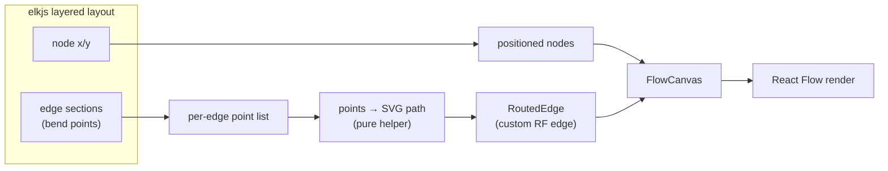

# refactor: viewer polish — collapsed rail, edge routing, drop playback

## Summary

Four focused changes to the workflow viewer:

1. The left rail starts **collapsed by default** (a stored preference still wins).
2. The landing page features **Multi-Platform Indholdsproduktion** (`content-generation`) instead of `figma-to-code`.
3. The **run-playback feature is removed entirely** — the play/pause/step/reset controls, the topological-walk logic, the active-node/edge animation, and their tests and CSS. It doesn't add real value and adds surface area.
4. **Edges route around node cards** so a connector never visually crosses a node, using the bend points elkjs already computes during layout (today they're discarded and React Flow draws straight beziers over nodes). Arrowheads and edge labels are preserved.

The graph engine, node inspector, schema, and rail behavior are otherwise unchanged.

---

## Problem Frame

Three of these are quick corrections; one is real engineering.

- **Rail default / featured workflow** — currently the rail opens expanded and the landing features `figma-to-code`. Both are one-line defaults that should change.
- **Playback** — the press-play animation walks the graph node-by-node. In practice it doesn't help readers understand a workflow, and it carries a chunk of code (a reducer, a timer, active-state plumbing across the canvas, custom CSS) that's pure liability once removed.
- **Edge collisions** — the real problem. `layoutWorkflow` asks elkjs for a layered layout but only reads node `x/y`; it throws away elk's computed **edge routing**. React Flow then draws a direct bezier from source handle to target handle, which cuts straight across any node card in the way — visually messy, especially on fan-out workflows like the new featured one (one API node branching into three LLM nodes, converging on a human gate, fanning out to three actions). The fix is to use elk's node-avoiding bend points and render them through a custom edge.

---

## Requirements

- **R1** — The rail renders collapsed by default for a first-time visitor; a previously stored expand/collapse preference still overrides.
- **R2** — The landing page features the `content-generation` workflow.
- **R3** — Run playback is removed entirely: controls, topological-walk module, active-node/edge animation wiring, associated tests, and associated CSS. Node inspection and the rest of the graph are unaffected.
- **R4** — Every edge routes around node cards (no connector visually crosses a node), using elkjs-computed paths. Arrowheads and edge labels are preserved.

**Success criteria:** the landing shows `content-generation` with a collapsed rail and no play button; on that workflow's fan-out, every edge visibly routes around the nodes with no overlaps, arrows and labels intact.

---

## High-Level Technical Design

### Edge-routing pipeline (the load-bearing change)

Today only the left path runs; this plan adds the edge path and a custom renderer.

The key shift: `layoutWorkflow` returns **both** positioned nodes and routed edges, so the async layout result becomes the single source the canvas renders from — edges are no longer computed synchronously and drawn as straight beziers.

---

## Key Technical Decisions

- **KTD1 — Use elk's edge routing, not wider spacing.** elk's layered algorithm already produces node-avoiding bend points; we render them. This *guarantees* no node crossings, where spacing tweaks only reduce the odds. (Confirmed with user: do it properly.)
- **KTD2 — `layoutWorkflow` returns `{ nodes, edges }`.** Routed edges carry their point list. The canvas consumes the async layout result for both, reusing the existing "layout keyed by workflow id" guard so a stale layout never renders.
- **KTD3 — Points→SVG-path is a pure helper.** Extracted and unit-tested independently; the custom edge renders the path with lightly rounded corners and preserves marker + label.
- **KTD4 — elk `edgeRouting: ORTHOGONAL`.** Clean right-angle routes that read as structured "wiring" and guarantee avoidance. (`POLYLINE`/`SPLINES` are alternatives if a curvier look is wanted later — a one-option change.)
- **KTD5 — Rail default flips to collapsed; persistence unchanged.** Default state becomes collapsed; the post-mount localStorage read still overrides. Server and first client render agree (both collapsed), so no hydration change.
- **KTD6 — Keep data-driven `animated` edges.** The ambient dashed-flow on edges flagged `animated` in the data is separate from the press-play feature and stays; only the playback-driven animation is removed.

---

## Implementation Units

### U1. Defaults: collapsed rail + featured workflow

**Goal:** Land collapsed, on the content-generation workflow.
**Requirements:** R1, R2.
**Dependencies:** none.
**Files:**
- `src/components/Rail.tsx` — default collapse state becomes collapsed.
- `src/data/index.ts` — `FEATURED_WORKFLOW_ID` → `content-generation`.
- `src/components/Rail.test.tsx` — update for collapsed-by-default.

**Approach:** One-line default flips. The rail's persisted-preference effect (KTD5) is untouched, so a returning user who expanded the rail still sees it expanded. The existing featured-selector test (`src/data/index.test.ts`) is id-agnostic and needs no change.
**Patterns to follow:** existing collapse state and persistence in `src/components/Rail.tsx`.
**Test scenarios** (`src/components/Rail.test.tsx`):
- Default render with no stored preference → rail is collapsed; item titles are not shown.
- Clicking the expand toggle → items render, grouped by category.
- With stored preference "expanded" → items render after mount (rail expanded).
- (Existing active-highlight / link / grouping assertions are updated to expand the rail first, since items aren't visible while collapsed.)
**Verification:** landing shows a collapsed rail and the content-generation graph; toggling and persistence still work.

---

### U2. Remove run playback

**Goal:** Delete the press-play feature and its footprint.
**Requirements:** R3.
**Dependencies:** none (independent of U1; precedes U3 since both touch the canvas).
**Files:**
- Delete `src/lib/playback.ts`, `src/lib/playback.test.ts`, `src/components/PlaybackControls.tsx`.
- `src/components/WorkflowViewer.tsx` — remove the playback reducer, timer, execution-order, and the controls render; keep node-selection + inspector.
- `src/components/FlowCanvas.tsx` — remove the `activeNodeId` prop and the effect that toggled the active-node class and active-edge animation; keep edges' base `animated` flag (KTD6).
- `src/app/globals.css` — remove the `.rf-node-active` rule and the `node-pulse` keyframes; keep the edge dash animation.

**Approach:** Pure removal. After deleting the active-state effect, edges render with their data-driven `animated` flag and nodes have no active class — the graph is static-but-interactive (pan/zoom/click-to-inspect). Confirm nothing else imports the deleted modules before deleting.
**Patterns to follow:** the dead-code removal pattern from the prior refactor (delete + grep for dangling imports).
**Test expectation:** none — deletion only; the suite stays green minus the removed playback tests. `WorkflowViewer`/`FlowCanvas` have no unit tests and their remaining behavior is unchanged.
**Verification:** no play controls anywhere; clicking a node still opens the inspector; `npm test` and `npm run build` pass.

---

### U3. elkjs edge routing + custom edge

**Goal:** Edges route around nodes instead of crossing them.
**Requirements:** R4.
**Dependencies:** U2 (both edit `FlowCanvas`; do the removal first).
**Files:**
- `src/lib/layout.ts` — enable elk `edgeRouting` (KTD4); change the return to `{ nodes, edges }` where each routed edge carries its ordered point list extracted from elk's `sections` (startPoint + bendPoints + endPoint).
- `src/lib/edge-path.ts` (new) — pure helper: an ordered point list → an SVG path string with lightly rounded corners.
- `src/lib/edge-path.test.ts` (new).
- `src/components/edges/RoutedEdge.tsx` (new) — custom React Flow edge: builds the path from `data.points` via the helper, renders it with the arrowhead marker, and renders the edge label at the path midpoint.
- `src/components/FlowCanvas.tsx` — register `edgeTypes = { routed: RoutedEdge }`; drive edges from the async layout result; merge per-edge styling (stroke color by source node type, marker, label) onto the routed edges and set their `type` to `routed`.
- `src/lib/layout.test.ts` — update for the new return shape and routed edges.

**Approach (KTD1–KTD4):** elk already computes edge sections during layered layout; this unit reads them. `layoutWorkflow` returns nodes and edges together so the canvas renders both from one async result (reusing the existing layout-ready guard). The points→path conversion is isolated in `edge-path.ts` for testability; `RoutedEdge` is a thin renderer over it. Edge endpoints must line up with React Flow's source/target handles (left/right mid of each card) — anchor the path ends to the handle positions and use elk's bend points for the interior, so routing and handles agree (see Risks).
**Technical design (directional):** elk per-edge geometry is `edge.sections[0] = { startPoint, bendPoints[], endPoint }`; flatten to `[start, ...bends, end]`. The helper walks that list emitting `M`/`L` segments with a short quadratic curve at each bend for rounded corners. `RoutedEdge` wraps the path in React Flow's `BaseEdge` and places the label via `EdgeLabelRenderer` at the polyline midpoint.
**Patterns to follow:** existing elk graph construction and the node-mapping in `src/lib/layout.ts`; existing edge styling (stroke-by-source-type, marker, label) in `src/components/FlowCanvas.tsx`'s `buildStyledEdges`.
**Test scenarios** (`src/lib/edge-path.test.ts`):
- Two points (no bends) → a path from start to end (`M … L …`), no NaN.
- Four points (two bends) → path traverses every point in order.
- Rounded corners: a bend produces a curve command rather than a hard vertex.
- Single point or empty list → returns a safe empty/degenerate path, no throw.
**Test scenarios** (`src/lib/layout.test.ts`, updated):
- `layoutWorkflow` returns both `nodes` and `edges`.
- Every input edge id appears exactly once in the output edges.
- Each routed edge has ≥2 points with numeric coordinates.
- A branching workflow (condition → two targets) yields at least one edge with interior bend points (length > 2), evidence of routing.
**Verification:** on the content-generation fan-out, every connector routes around the node cards with no crossings; arrowheads and labels (e.g. "Godkendt") render correctly; `npm run build` and the suite pass.

---

## Risks & Dependencies

- **Handle vs. elk endpoint alignment.** elk routes border-to-border; React Flow handles sit at the left/right mid of each card. If the path ends use elk's raw endpoints they may not meet the rendered handles. Mitigation (U3 approach): anchor path endpoints to the React Flow handle positions and use elk bend points only for the interior. Verify visually on a branch workflow.
- **Async edges / flash.** Edges now come from the async layout. Reuse the existing layout-keyed-by-workflow-id guard so a stale or empty edge set never renders mid-layout.
- **Label placement on a polyline.** Labels previously sat on a bezier midpoint; on a routed polyline, compute the midpoint along the point list so labels don't drift onto a node.
- **Dead-import safety (U2).** Grep for importers of `playback`/`PlaybackControls` before deleting; tsc/build catch the rest.

---

## Scope Boundaries

**In scope:** the four changes above.

**Out of scope:** changes to node inspection, the schema, auto-layout *node* placement, rail navigation behavior, or theming beyond removing playback CSS.

### Deferred to Follow-Up Work

- Curved (`SPLINES`) edge routing as an aesthetic option if the orthogonal look feels too rigid.
- Edge hover/selection affordances on the new custom edge.

---

## Sources & Research

- Codebase (authored this session): `src/lib/layout.ts` (elk layout, node-only extraction today), `src/components/FlowCanvas.tsx` (synchronous bezier edges, active-state effect), `src/components/WorkflowViewer.tsx` + `src/components/PlaybackControls.tsx` + `src/lib/playback.ts` (playback), `src/components/Rail.tsx` (collapse default), `src/data/index.ts` (`FEATURED_WORKFLOW_ID`), `src/app/globals.css` (`rf-node-active`, `node-pulse`). Stack: Next.js 16, React 19, React Flow (`@xyflow/react`) v12, elkjs v0.11.
- No external research — elk edge routing is a documented capability of the already-installed layout engine; the work is using data the layout step already produces.
